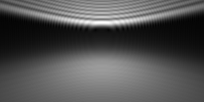

# C++17 port of the MicroscPSF-Matlab project

[](https://github.com/MicroscPSF/MicroscPSF-Cpp/actions/workflows/validate-build.yml)

## Status

Currently, this work is a *very* early work in progress. Refer to
https://github.com/MicroscPSF/MicroscPSF-Matlab for the reference implementation.

## Quick start

### Ubuntu/Linux

Install the compiler toolchain and the BLAS/LAPACK library:

```bash
sudo apt install build-essentials

# Use Openblas or Atlas or the original BLAS/LAPACK.
sudo apt install libopenblas-dev
```

Install Meson the build system:

```bash
cd MicroscPSF-Cpp/
python3 -m venv .venv/
.venv/bin/pip3 install meson ninja
```

Compile everything

```bash
cd MicroscPSF-Cpp/
meson setup build/
ninja -C build all
```

Test everything

```bash
cd MicroscPSF-Cpp/build/
ninja test
```

(Optional) Install the example app

```bash
ninja install
cd MicroscPSF-Cpp/build/
meson configure -Dinstall_examples=true
ninja all
sudo ninja install
```

## Running the examples

First, follow the *Quick start* instructions to build the example app. Then, given the following microscope configurations in the screenshot...


... program the example C++ file at
[examples/generate-psf.cpp](https://github.com/MicroscPSF/MicroscPSF-Cpp/blob/main/examples/generate-psf.cpp)

```c++
microscope_params_t params{};
params.NA = 1.4;
params.ti0 = 150.0_um;
params.ni = 1.5;
params.ni0 = 1.5;
params.pz = 2.0_um;

precision_li2017_t precision{};
precision.num_basis = 153;
precision.rho_samples = 1000;

const auto psf =
    makePSF(params, {0.1_um, 0.25_um}, {256, 128}, 0.610_um, precision);
```

Next, repeat the *Quick start* steps to re-compile the C++ app. Run `ninja test`
to invoke the compiled example. Locate the outputs `psf_xy.pgm`, `psf_xz.pgm`,
and `psf.h5`. The XZ cross-section of the C++-simulated PSF should match the
screenshot above.



## Appendix: Bessel function support

- The original ISO C++ proposal: https://wg21.link/p0226r1
- GCC compiler support status: https://gcc.gnu.org/onlinedocs/libstdc++/manual/status.html#status.iso.2017
- Clang support status: https://libcxx.llvm.org/Status/Cxx17.html
- Clang support ticket: https://github.com/llvm/llvm-project/issues/99939